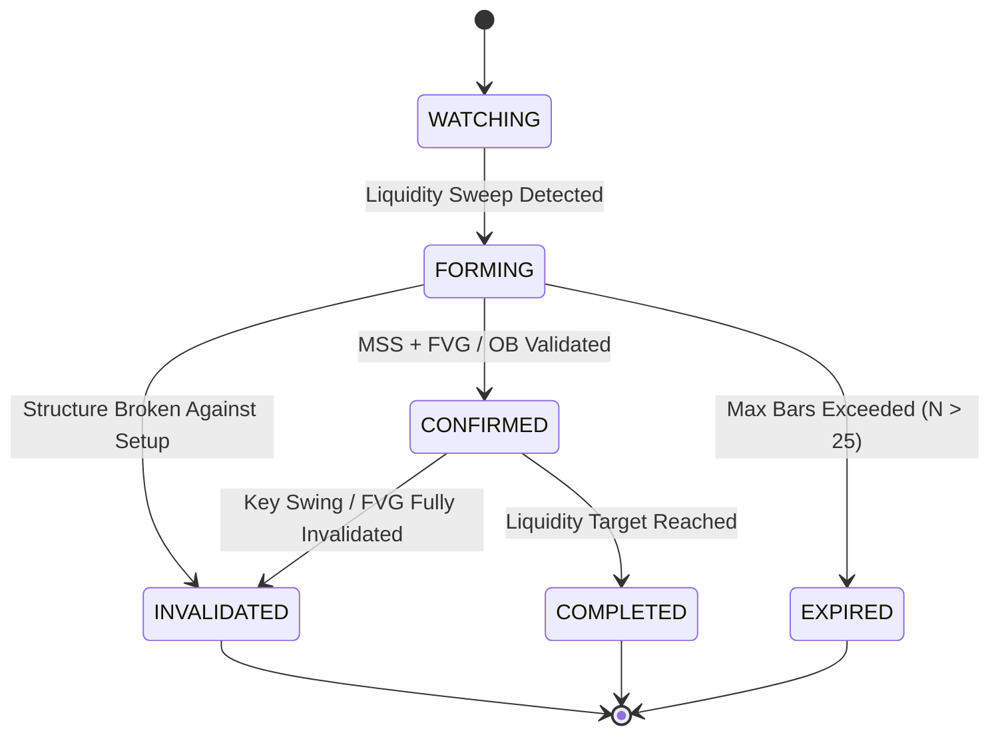

# PHASE 30 — ICT MODEL V1 SPECIFICATION

> **Document Status**: `FORMAL SPECIFICATION & CONCEPTUAL AUDIT`  
> **Target Release**: `TradeSea ICT Analytical & Visual Indicator V1`  
> **Production Code Changes in CP30**: `NONE` (`FINAL MODEL CHANGE: NONE`)  
> **Implementation Target**: `Checkpoint 31 (CP31)`

---

## 1. OBJETIVO Y ALCANCE

El objetivo de este documento es definir formal y deterministamente la especificación conceptual, analítica y visual del **ICT Model V1** que impulsará el indicador visual para la extensión TradeSea.

### Principios Fundamentales
1. **Indicador Analítico y Visual**: El sistema detecta, clasifica y visualiza estructuras de mercado en tiempo real. **NO** genera señales de trading automático (`BUY`/`SELL`), no administra órdenes, no fija Stop Loss / Take Profit cuantitativos ni calcula ratios de rentabilidad.
2. **Causalidad Estricta y Anti-Lookahead**: Toda confirmación de patrón o cambio de estado requiere la confirmación de la vela correspondiente. Ninguna estructura futura puede alterar retroactivamente un evento confirmado.
3. **Decoupling de Lógica de Negocio y Presentación**: La máquina de detección es determinista y pura (compatible con Node.js, Replay y Web Workers), separada del renderizado visual (Canvas / TradingView Adapter / HUD UI).

---

## 2. REGLA DE SEPARACIÓN CONCEPTUAL

Para cada elemento del modelo ICT V1, la especificación se desglosa en cuatro dimensiones obligatorias:

1. **Concepto ICT**: Definición teórica del patrón según la metodología ICT.
2. **Definición Operacional**: Regla determinista algorítmica traducible directamente a código TypeScript.
3. **Visualización**: Representación gráfica en gráfico (líneas, cajas, etiquetas, colores).
4. **Contexto**: Información añadida al HUD para orientación del usuario sin constituir recomendación.

### Tratamiento de Conceptos No Deterministamente Especificables
Si un concepto ICT no posee una regla objetiva unívoca (e.g., "intención del institucional", "momentum subjetivo", "calidad subjetiva del FVG"), se clasifica explícitamente como:

`CONCEPTO_NO_DETERMINISTA`

Está estrictamente prohibido inventar reglas arbitrarias para forzar la automatización de conceptos declarados como `CONCEPTO_NO_DETERMINISTA`.

---

## 3. ARQUITECTURA MULTI-TIMEFRAME (MTF)

### 3.1. Definición de Jerarquía de Temporalidades
El modelo V1 adopta una estructura jerárquica de 3 temporalidades configurables por el usuario:

- **HTF (Higher Timeframe)**: Define el sesgo direccional macro y los niveles clave de liquidez/PD Arrays institucionales (e.g., 15m).
- **CTF (Context Timeframe)**: Proporciona la estructura intermedia de apoyo y la zona de interacción (e.g., 5m).
- **LTF (Lower Timeframe)**: Captura la microestructura de entrada, sweeps locales y confirmación de setups (e.g., 1m).

### 3.2. Regla de Causalidad y Velas HTF Incompletas
1. **Vela Abierta**: Mientras una vela HTF/CTF permanezca abierta (`timestamp < confirmationTimestamp`), sus máximos, mínimos y cierres son **provisionales**.
2. **No Propagation of Unclosed Data**: Un evento HTF (BOS HTF, FVG HTF) sólo se considera **confirmado** cuando la vela HTF correspondiente ha cerrado.
3. **Timestamping Invariante**:
   - `eventTimestamp`: Epoch ms del inicio de la vela donde ocurre el toque/ruptura.
   - `confirmationTimestamp`: Epoch ms del cierre de la vela (cuando los datos quedan congelados).

---

## 4. ESTRUCTURA DE MERCADO (MARKET STRUCTURE)

### 4.1. Swing High & Swing Low
- **Concepto**: Puntos pivote de inflexión donde el precio genera un máximo o mínimo local.
- **Definición Operacional**:
  - **Swing High**: Vela $i$ donde `high[i] > high[i-left]` para todo $left \in [1, N]$ AND `high[i] > high[i+right]` para todo $right \in [1, N]$. (Parámetro por defecto $N=2$).
  - **Swing Low**: Vela $i$ donde `low[i] < low[i-left]` para todo $left \in [1, N]$ AND `low[i] < low[i+right]` para todo $right \in [1, N]$.
- **Confirmación**: Se confirma en el cierre de la vela $i + N$.
- **Invalidez**: Inviolable una vez formado.

### 4.2. Break of Structure (BOS)
- **Concepto**: Continuación de la tendencia imperante mediante la ruptura de un Swing reciente en la misma dirección.
- **Definición Operacional**:
  - **Bullish BOS**: `close[k] > activeSwingHigh.price` (Ruptura por CIERRE de vela).
  - **Bearish BOS**: `close[k] < activeSwingLow.price` (Ruptura por CIERRE de vela).
- **Regla Close vs. Wick**: El BOS **requiere cierre de cuerpo** por encima/debajo del swing level. Las mechas (wicks) sin cierre se clasifican como `LIQUIDITY_SWEEP` o `FALSE_BREAK`.
- **Persistencia**: Un Swing Level roto por BOS deja de ser nivel activo de estructura y pasa a estado `BROKEN`.

### 4.3. Market Structure Shift (MSS)
- **Concepto**: Cambio de carácter estructural donde el precio rompe el último Swing contra-tendencia clave tras manipular liquidez.
- **Definición Operacional**:
  - **Bullish MSS**: Tras una secuencia bajista, la vela $k$ cierra por encima del último Swing High relevante previo al mínimo más bajo (`close[k] > keySwingHigh.price`).
  - **Bearish MSS**: Tras una secuencia alcista, la vela $k$ cierra por debajo del último Swing Low relevante previo al máximo más alto (`close[k] < keySwingLow.price`).
- **Diferencia con BOS**: BOS es continuación de tendencia; MSS es cambio de tendencia precedido por toma de liquidez.

---

## 5. LIQUIDEZ (LIQUIDITY)

### 5.1. Niveles de Liquidez (BSL / SSL / EQH / EQL)
- **BSL (Buy-Side Liquidity)**: Máximos de swings anteriores, Equal Highs o máximos de sesión/día.
- **SSL (Sell-Side Liquidity)**: Mínimos de swings anteriores, Equal Lows o mínimos de sesión/día.
- **Equal Highs / Equal Lows (EQH / EQL)**: Dos o más swings cuyos máximos/mínimos están dentro de una tolerancia porcentual (`toleranceRatio = 0.0005` o 0.05%).

### 5.2. Liquidity Sweep vs. Breakout
- **Liquidity Sweep**: El precio penetra un nivel BSL/SSL con la mecha (`high > BSL` o `low < SSL`), pero la vela **cierra de vuelta dentro** del rango (`close <= BSL` o `close >= SSL`).
- **Breakout**: El precio rompe el nivel BSL/SSL y **cierra por fuera** del nivel.
- **False Sweep**: Ruptura por mecha que no genera desplazamiento posterior inmediato.

---

## 6. DISPLACEMENT (DESPLAZAMIENTO)

- **Concepto**: Movimiento expansivo violento que demuestra presencia institucional y limpia liquidez o genera estructura.
- **Definición Operacional (Parámetros Existentes Congelados)**:
  - `bodyRatio = abs(close - open) / (high - low) >= 0.60` (El cuerpo representa al menos el 60% del rango total de la vela).
  - `rangeMultiplier = (high - low) / averageRange(20) >= 1.50` (El rango de la vela es 1.5x superior al rango promedio de las últimas 20 velas).
- **Rol en Modelos V1**: Contexto obligatorio para confirmar `MSS` e insumo para la creación de `FVG`.

---

## 7. FAIR VALUE GAP (FVG)

- **Concepto**: Desequilibrio de 3 velas (Inefficiency / Imbalance) donde la mecha de la vela 1 y la mecha de la vela 3 no se solapan.
- **Definición Operacional**:
  - **Bullish FVG**: `low[i] > high[i-2]` (Vela $i-1$ es la vela expansiva).
  - **Bearish FVG**: `high[i] < low[i-2]`.
- **Estados de Ciclo de Vida**:
  - `ACTIVE`: FVG creado sin solape de precio posterior.
  - `PARTIALLY_MITIGATED`: El precio ha entrado en la zona entre `high[i-2]` y `low[i]` pero no la ha atravesado por completo.
  - `FULLY_MITIGATED`: El precio ha atravesado el 100% del rango del FVG.
  - `INVALIDATED`: Cierre de vela por completo al lado opuesto del FVG.

---

## 8. ORDER BLOCK (OB) — VARIANT B (ICT STANDARD)

- **Concepto**: Última vela de dirección contraria antes de un movimiento impulsivo expansivo que rompe estructura (BOS/MSS) y deja un FVG.
- **Definición Operacional (Variant B)**:
  - **Bullish OB**: Última vela bajista (`close < open`) previa al impulso alcista que genera BOS/MSS y crea un FVG Bullish.
  - **Bearish OB**: Última vela alcista (`close > open`) previa al impulso bajista que genera BOS/MSS y crea un FVG Bearish.
- **Estados de Ciclo de Vida**:
  - `UNTESTED`: El precio no ha vuelto a tocar la zona de la vela de origen.
  - `TESTED`: El precio ha testeado la mecha/cuerpo sin cerrar por debajo del mínimo (Bullish) o por encima del máximo (Bearish).
  - `MITIGATED / INVALIDATED`: Cierre de vela por debajo del cuerpo/mínimo del OB.

---

## 9. BREAKER BLOCK Y MITIGATION BLOCK

- **Evaluación V1**: `DEFERRED_TO_V2`.
- **Justificación**: Breakers y Mitigation Blocks dependen de la confirmación previa compleja de múltiples niveles de sweeps y fallos de swing. Para mantener V1 determinista, simple y libre de falsos positivos, se difieren a la versión V2.

---

## 10. PREMIUM / DISCOUNT & DEALING RANGE

- **Concepto**: Medición del rango operativo actual entre el Swing Low más reciente y el Swing High más reciente para clasificar las zonas de precio.
- **Definición Operacional**:
  - `Range High`: Máximo del Dealing Range activo.
  - `Range Low`: Mínimo del Dealing Range activo.
  - `Equilibrium (EQ)`: `(Range High + Range Low) / 2`.
  - `Discount Zone`: Precio por debajo del Equilibrium (`price < EQ`).
  - `Premium Zone`: Precio por encima del Equilibrium (`price > EQ`).
- **Naturaleza en V1**: **Puro Contexto**. No constituye disparador de entrada ni señal automatizada.

---

## 11. LIQUIDITY TARGET (OBJETIVO DE LIQUIDEX CONTEXTUAL)

- **Concepto**: Identificación visual de niveles de BSL o SSL opuestos hacia los cuales la estructura sugiere que el precio gravita.
- **Definición Operacional**: El nivel de BSL/SSL intacto más próximo en la dirección de la estructura confirmada por MSS.
- **Naturaleza en V1**: Referencia visual decorativa en gráfico y HUD. **NO** es un Take Profit cuantitativo ni orden de salida.

---

## 12. MODELOS ICT V1 (A, B, C)

### 12.1. Model A: Sweep -> MSS -> FVG (Silver Bullet Pattern)
- **Secuencia**:
  1. `LIQUIDITY_SWEEP` (SSL para Long, BSL para Short).
  2. `MSS_CONFIRMED` en dirección opuesta al sweep dentro de $N \le 25$ velas.
  3. `FVG_CREATION` confluente con el movimiento de MSS.
- **Estados**: `WATCHING` -> `FORMING` -> `CONFIRMED`.

### 12.2. Model B: Sweep -> Displacement -> FVG
- **Secuencia**:
  1. `LIQUIDITY_SWEEP` (SSL para Long, BSL para Short).
  2. `DISPLACEMENT` (velas expansivas con `bodyRatio >= 0.60` y `rangeMultiplier >= 1.50`).
  3. `FVG_CREATION` dentro del impulso desplante.

### 12.3. Model C: HTF Alignment -> Sweep -> MSS -> FVG/OB -> Target
- **Secuencia**:
  1. Alineación de sesgo HTF (Trend HTF en Discount/Premium).
  2. LTF `LIQUIDITY_SWEEP`.
  3. LTF `MSS_CONFIRMED` + `FVG` / `OB`.

---

## 13. AUDITORÍA DE SIMETRÍA LONG / SHORT

Se ha verificado que todas las condiciones operacionales entre patrones alcistas (`LONG`) y bajistas (`SHORT`) son estrictamente simétricas.

- **Bullish BOS**: `close > High` $\leftrightarrow$ **Bearish BOS**: `close < Low`.
- **Bullish Sweep**: `low < SSL && close >= SSL` $\leftrightarrow$ **Bearish Sweep**: `high > BSL && close <= BSL`.
- **Bullish FVG**: `low[i] > high[i-2]` $\leftrightarrow$ **Bearish FVG**: `high[i] < low[i-2]`.

---

## 14. MÁQUINA DE ESTADOS DE SETUPS (SETUP STATE MACHINE)



### Reglas de Transición
- **WATCHING**: Monitorizando zona de liquidez BSL/SSL.
- **FORMING**: Ocurre el Sweep de liquidez; buscando confirmación estructural.
- **CONFIRMED**: MSS confirmado + FVG/OB activo.
- **INVALIDATED**: Ruptura del swing invalidador o anulación del FVG/OB de origen.
- **COMPLETED**: El precio alcanza el nivel BSL/SSL target.
- **EXPIRED**: Transcurren más de 25 velas sin confirmación.

---

## 15. ESPECIFICACIÓN ANTI-LOOKAHEAD

Toda la evaluación del indicador V1 se rige bajo la regla inmutable:

$$\text{Data Available at Step } t = \text{Candles}[0 \dots t]$$

- Un setup o evento en la vela $t$ se evalúa exclusivamente con la información cerrada en $t$.
- Las velas futuras $t+1 \dots N$ son completamente inaccesibles durante la detección.

---

## 16. COMPORTAMIENTO EN REPLAY (REPLAY SPECIFICATION)

El motor garantiza equivalencia perfecta entre procesamiento por lotes y streaming vela a vela:

$$\text{Replay}(\text{Candles}[0 \dots N]) \equiv \text{BatchProcess}(\text{Candles}[0 \dots N])$$

Cada iteración del Replay ejecuta:
1. `Ingest Candle[t]`
2. `Update Swings & Liquidity`
3. `Evaluate Structure (BOS/MSS)`
4. `Evaluate FVG & Order Blocks`
5. `Update Setup State Machine`
6. `Emit Render Event & HUD Update`

---

## 17. ESPECIFICACIÓN VISUAL (CHART RENDERER)

| Elemento | Visible por Defecto | Color / Estilo | Etiqueta Texto | Persistencia |
| :--- | :--- | :--- | :--- | :--- |
| **Swing High / Low** | Sí (opcional toggle) | Verde / Rojo (Puntos) | `SH` / `SL` | Temporal hasta rotura |
| **BOS** | Sí | Azul / Dashed | `BOS` | Permanente |
| **MSS** | Sí | Púrpura / Solid | `MSS` | Permanente |
| **BSL / SSL** | Sí | Naranja / Dashed | `BSL` / `SSL` | Hasta Sweep |
| **Liquidity Sweep** | Sí | Amarillo / Icono X | `SWEEP` | Permanente |
| **Fair Value Gap** | Sí | Cian / Caja Semitransparente | `FVG` | Hasta Mitigación 100% |
| **Order Block** | Sí | Marrón / Caja Semitransparente | `OB` | Hasta Mitigación |
| **Equilibrium** | Sí | Gris / Dotted | `EQ (50%)` | Dinámico en Dealing Range |

---

## 18. ESPECIFICACIÓN DEL HUD (HEADS-UP DISPLAY UI)

El HUD desplegado en la interfaz TradeSea proporcionará resumen analítico en 5 paneles informativos:

1. **MARKET STRUCTURE**: Trend activo (Bullish/Bearish/Sideways), último BOS, último MSS.
2. **LIQUIDITY**: Niveles BSL y SSL más cercanos, último Sweep detectado.
3. **PD ARRAY**: Zona activa (Premium / Discount), FVG activo más cercano, OB activo más cercano.
4. **DISPLACEMENT**: Presencia de velas impulsivas, `bodyRatio`, `rangeMultiplier`.
5. **MODEL TRACKER**: Modelo activo (Model A/B/C), Estado (`FORMING`, `CONFIRMED`), condiciones cumplidas.

> [!IMPORTANT]
> **PROHIBICIÓN EN HUD**: Queda estrictamente prohibido mostrar palabras como `BUY`, `SELL`, porcentajes de acierto, win rates, o instrucciones automáticas de trading.

---

## 19. MODELO DE DATOS Y TIPOS TYPESCRIPT

Los siguientes tipos fundamentales representan el dominio del ICT Model V1:

```typescript
export type ICTModelId = 'MODEL_A' | 'MODEL_B' | 'MODEL_C';
export type SetupState = 'WATCHING' | 'FORMING' | 'CONFIRMED' | 'INVALIDATED' | 'COMPLETED' | 'EXPIRED';

export interface ICTMarketContextV1 {
  symbol: string;
  timeframe: Timeframe;
  trend: 'BULLISH' | 'BEARISH' | 'SIDEWAYS';
  dealingRange: {
    high: number;
    low: number;
    equilibrium: number;
    zone: 'PREMIUM' | 'DISCOUNT' | 'EQUILIBRIUM';
  };
  activeBSL: number[];
  activeSSL: number[];
  activeFVGs: FVG[];
  activeOBs: OrderBlock[];
}

export interface ICTSetupV1 {
  id: string;
  modelId: ICTModelId;
  direction: 'LONG' | 'SHORT';
  state: SetupState;
  detectedTimestamp: number;
  confirmedTimestamp?: number;
  invalidatedTimestamp?: number;
  fulfilledConditions: string[];
  missingConditions: string[];
  targetLiquidityPrice?: number;
}
```

---

## 20. CONFIGURACIÓN DEL USUARIO VS. DEFINICIÓN DEL MODELO

| Parámetro | Configurable por Usuario | Definición de Modelo Fija | Rango Permitido |
| :--- | :--- | :--- | :--- |
| **HTF Timeframe** | Sí | No | 5m, 15m, 1h, 4h, 1d |
| **LTF Timeframe** | Sí | No | 1m, 3m, 5m |
| **Swing Strength ($N$)** | Sí | No | 1 a 5 velas |
| **FVG Min Size (pts)** | Sí | No | 0.0 a 10.0 pts |
| **Model Requirements** | No | **Sí (Fijo)** | Reglas estrictas A/B/C |
| **Close vs Wick Rules** | No | **Sí (Fijo)** | Close para BOS/MSS |

---

## 21. MATRIZ DE DEPENDENCIAS

| Concepto | Depende De | Produce | Timeframe | Confirmación |
| :--- | :--- | :--- | :--- | :--- |
| **Swing Point** | Candles | Swing High / Low | LTF / HTF | $i + N$ candle close |
| **Liquidity Level** | Swing High / Low | BSL / SSL | LTF / HTF | Swing Confirmation |
| **Liquidity Sweep** | BSL / SSL + Candle | Evento Sweep | LTF | Immediate candle close |
| **Displacement** | Candle Range + Vol | Contexto Impulsivo | LTF | Candle close |
| **BOS** | Active Swing + Close | Evento BOS | LTF / HTF | Candle close > Swing |
| **MSS** | Key Swing + Sweep + Close | Evento MSS | LTF | Candle close > Key Swing |
| **FVG** | 3-Candle Disbalance | Objeto FVG | LTF / HTF | Candle 3 close |
| **Order Block** | Origin Candle + Displacement | Objeto OrderBlock | LTF / HTF | FVG + BOS Confirmation |
| **Dealing Range** | Swings Relevantes | EQ / Premium / Discount | HTF / CTF | Continuous |
| **Setup State** | Sweep + MSS + FVG | ICTSetup Object | LTF | State Transition Event |

---

## 22. PREGUNTAS CONCEPTUALES ABIERTAS (OPEN CONCEPTUAL QUESTIONS)

| ID | Pregunta Conceptual | Implementación Actual | Opciones Posibles | Impacto | Decisión Requerida |
| :--- | :--- | :--- | :--- | :--- | :--- |
| **Q1** | ¿MSS requiere siempre desplazamiento violento previa o simultáneamente? | Opcional | A) Obligatorio<br>B) Opcional | Filtrado de falsos cambios estructurales | Definir en CP31 |
| **Q2** | ¿Qué porcentaje mínimo de solape define la mitigación parcial de un FVG? | > 0% | A) Cierto % (25/50%)<br>B) Cualquier toque | Sensibilidad del estado FVG | Definir en CP31 |
| **Q3** | ¿Un Order Block invalida en toque de mecha o requiere cierre por completo? | Cierre de cuerpo | A) Cierre de cuerpo<br>B) Ruptura por mecha | Durabilidad de zonas OB | Definir en CP31 |

---

## 23. COMPONENTES INCLUIDOS EN V1

- Swings (Pivot High / Low).
- BOS (Break of Structure por Cierre).
- MSS (Market Structure Shift con Sweep previo).
- Liquidez BSL / SSL y Equal Highs / Lows.
- Sweeps de Liquidez (Wick Sweep con Cierre dentro).
- Fair Value Gaps (FVG Alcista / Bajista, estados de mitigación).
- Order Blocks Variant B (ICT Standard con FVG confluente).
- Dealing Range & Zonas Premium / Discount.
- Modelos A, B y C.
- HUD Analítico Informativo.
- Renderizado Visual en Chart.

---

## 24. COMPONENTES DIFERIDOS A V2

- Breaker Blocks.
- Mitigation Blocks.
- Inversion FVGs (IFVG).
- Balanced Price Ranges (BPR).
- Anchored VWAP / Liquidity Pools avanzadas.

---

## 25. PLAN DE IMPLEMENTACIÓN PARA CHECKPOINT 31 (CP31)

1. **Paso 1**: Refactorizar tipos en `core/ict/types/` conforme al Modelo de Datos V1 especificado en la Sección 19.
2. **Paso 2**: Implementar lógica determinista de confirmación Close-vs-Wick para BOS y MSS.
3. **Paso 3**: Actualizar `SetupEngine.ts` para soportar las transiciones exactas de la Máquina de Estados (Sección 14).
4. **Paso 4**: Integrar paneles descriptivos en el HUD UI sin incorporar señales de trading.
5. **Paso 5**: Ejecutar suite completa de regresión y validación en Replay.

---

```markdown
CHECKPOINT 30 STATUS

Production modified: NO
Active parameters modified: NO
MedianTR production enabled: NO
ICT detector modified: NO
Specification completed: PASS
Temporal model defined: PASS
Market Structure defined: PASS
Liquidity defined: PASS
Displacement defined: PASS
FVG defined: PASS
Order Block defined: PASS
Premium/Discount defined: PASS
Liquidity Target defined: PASS
Setup state machine defined: PASS
Anti-lookahead specification: PASS
Replay specification: PASS
Visual specification: PASS
HUD specification: PASS
Configuration specification: PASS
Dependency matrix: PASS
Open conceptual questions: PASS
V1 included components: PASS
V1 deferred components: PASS
Existing tests: 224/224 PASS
New tests: 0/0
Total tests: 224/224 PASS
Build: PASS
Regressions: NONE
Final model change: NONE
Ready for CP31 implementation: YES
```
